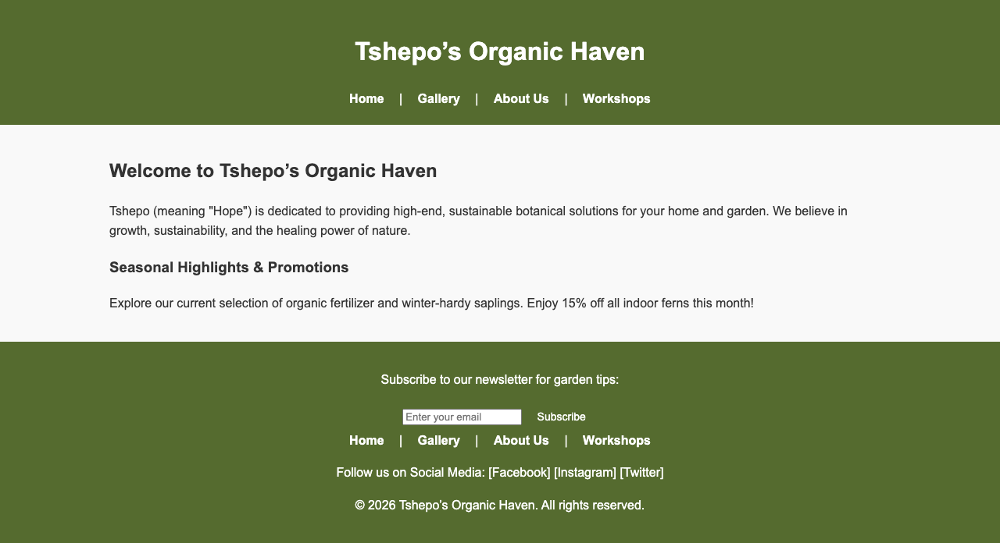

# 🌿 Tshepo's Organic Haven

### Sophia Learning: Web Programming 1 (CS1005) - Final Touchstone

## 🎓 Academic Achievement
* **Institution:** Sophia Learning / BSc Computer Science Path
* **Course:** Introduction to Web Development (CS1005)
* **Final Grade:** [Insert Your Score here, e.g., 98%]
* **Focus:** Responsive Design, Semantic HTML, and Vanilla JavaScript Integration.

## 📝 Project Overview
This project is a comprehensive web solution for "Organic Haven," a local organic grocery store. It was developed as a multi-page application to demonstrate mastery of the core pillars of web development.

### Key Features:
* **Responsive UI:** Fully functional on mobile, tablet, and desktop.
* **Interactive Gallery:** A dynamic showcase of organic products.
* **Workshop Enrollment:** Integrated forms for community engagement.
* **Consistent Branding:** Unified CSS architecture across all pages.

## 🛠️ Technical Stack
* **Frontend:** HTML5, CSS3 (Flexbox/Grid)
* **Logic:** JavaScript (ES6+)
* **Design Tools:** Figma (Wireframing & Storyboarding)
* **Version Control:** Git & GitHub

## 🔐 Cybersecurity & UX Considerations
As a student specializing in **Cybersecurity and UX**, I implemented:
1.  **Semantic HTML:** Improved accessibility (a11y) and SEO.
2.  **Input Validation:** Basic client-side checks for the contact/workshop forms.
* **Clean Code:** Organized directory structure for maintainability.

---
*Created by Tshepo, as part of my BSc in Computer Science curriculum.*
